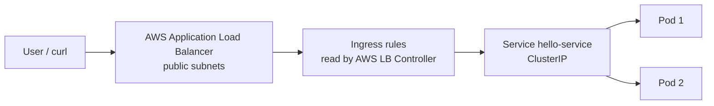

# Hello World on AWS EKS (Terraform + Ingress/ALB)

A small Flask API deployed to **Amazon EKS**, exposed to the internet through an **Application Load Balancer** created by a Kubernetes **Ingress**. All AWS infrastructure (VPC, EKS, node group, IAM, AWS Load Balancer Controller) is managed with **Terraform** and can be created or destroyed on demand.

```
User → ALB (Ingress) → Service hello-service → hello-api Pods (x2)
```

## Architecture



| Layer | Details |
|-------|---------|
| Region | `ap-south-1` (Mumbai) |
| Network | VPC `10.0.0.0/16`, 2 public + 2 private subnets across 2 AZs, single NAT gateway |
| Cluster | EKS `hello-eks`, Kubernetes 1.33, public API endpoint |
| Compute | 1 managed node group, 2 × `t3.small` (min 1 / desired 2 / max 3) |
| Ingress | AWS Load Balancer Controller (Helm, IRSA), `target-type: ip` |
| App | Flask + Gunicorn on port 8080, image stored in ECR |

## Repository structure

```
eks-task
└── app
    ├── app.py
    ├── requirements.txt
    ├── Dockerfile
    └── terraform
        ├── providers.tf
        ├── variables.tf
        ├── vpc.tf
        ├── eks.tf
        ├── lb-controller.tf
        ├── outputs.tf
        └── k8s
            ├── deployment.yaml
            ├── service.yaml
            └── ingress.yaml
```

## The application

| Endpoint | Response |
|----------|----------|
| `GET /` | `{"message":"Hello World","pod":"<pod-name>"}` |
| `GET /health` | `{"status":"ok"}` (used by readiness probe and ALB health check) |

The response includes the pod name, so load balancing across replicas is visible.

## Prerequisites

- AWS account and credentials (`aws configure`, region `ap-south-1`)
- [Terraform](https://developer.hashicorp.com/terraform/downloads) >= 1.5
- [kubectl](https://kubernetes.io/docs/tasks/tools/)
- [Docker](https://www.docker.com/products/docker-desktop/) (running)
- AWS CLI v2

Verify:

```powershell
aws --version
terraform --version
kubectl version --client
docker --version
aws sts get-caller-identity
```

## Quick start

### 1. Build and test locally

```powershell
cd app
docker build -t hello-api .
docker run -p 8080:8080 hello-api
# open http://localhost:8080
```

### 2. Push the image to ECR

The ECR repo is created outside Terraform on purpose, so `terraform destroy` does not delete your image.

```powershell
$AWS_REGION = "ap-south-1"
$ACCOUNT_ID = aws sts get-caller-identity --query Account --output text
$ECR = "$ACCOUNT_ID.dkr.ecr.$AWS_REGION.amazonaws.com"

aws ecr create-repository --repository-name hello-api --region $AWS_REGION
aws ecr get-login-password --region $AWS_REGION | docker login --username AWS --password-stdin $ECR

docker build --platform linux/amd64 -t hello-api .
docker tag hello-api:latest "$ECR/hello-api:v1"
docker push "$ECR/hello-api:v1"
```

Then set the `image:` field in `app/terraform/k8s/deployment.yaml` to `<ACCOUNT_ID>.dkr.ecr.ap-south-1.amazonaws.com/hello-api:v1` using your real 12-digit account ID.

### 3. Provision infrastructure (about 15 minutes)

```powershell
cd app/terraform
terraform init
terraform plan
terraform apply

aws eks update-kubeconfig --region ap-south-1 --name hello-eks
kubectl get nodes                    # 2 nodes Ready
kubectl get pods -n kube-system      # aws-load-balancer-controller Running
```

### 4. Deploy the app

```powershell
cd k8s
kubectl apply -f deployment.yaml -f service.yaml
kubectl port-forward svc/hello-service 8080:80   # quick test
```

Scale to 2 replicas (set `replicas: 2` in `deployment.yaml`) and re-apply:

```powershell
kubectl apply -f deployment.yaml
kubectl get pods -o wide
```

### 5. Expose it with the Ingress

```powershell
kubectl apply -f ingress.yaml
kubectl get ingress hello-ingress -w     # wait until ADDRESS shows an elb.amazonaws.com name
```

Allow about one more minute for targets to become healthy, then:

```powershell
$ALB = kubectl get ingress hello-ingress -o jsonpath='{.status.loadBalancer.ingress[0].hostname}'
1..10 | ForEach-Object { curl.exe -s http://$ALB/; "" }
kubectl logs -l app=hello-api --prefix=true --tail=20
```

Responses should show both pod names.

## Verification results

The cluster was verified end to end (details in [`docs/EKS_Cluster_Verification_Report.html`](docs/EKS_Cluster_Verification_Report.html)):

| Check | Result |
|-------|--------|
| Node pools | 1 managed node group, 2 × `t3.small`, `ACTIVE` |
| App pods | 2/2 running, one on each node |
| Ingress | `hello-ingress`, class `alb`, `/` → `hello-service:80` |
| Load balancer | Application Load Balancer, `internet-facing` |
| Public access | HTTP 200 via ALB DNS name |
| Load balancing | 10 requests split across both pods (6 / 4) |
| Logs | `kubectl logs -l app=hello-api --prefix=true` shows both pods |

> An ALB has no fixed IP. Always use its DNS name.

## Useful commands

```powershell
kubectl get pods -A -o wide
kubectl get svc -A
kubectl get endpoints hello-service
kubectl describe ingress hello-ingress
kubectl logs -f -l app=hello-api --prefix=true
kubectl logs -n kube-system deploy/aws-load-balancer-controller
```

## Clean up (important, to stop billing)

While the cluster exists it costs roughly **$0.25 to $0.30 per hour** (EKS control plane, NAT gateway, 2 EC2 nodes, ALB).

The ALB is created by the controller, not Terraform, so **delete the Ingress first**:

```powershell
cd app/terraform/k8s
kubectl delete -f ingress.yaml
# wait ~2 minutes for the ALB to be removed
kubectl delete -f service.yaml -f deployment.yaml
cd ..
terraform destroy
```

Afterwards confirm in `ap-south-1` that there are no EKS clusters, EC2 instances, NAT gateways, Elastic IPs or load balancers left. Do not move the `terraform` folder while the cluster exists, because `terraform.tfstate` is how Terraform knows what to destroy.

To recreate later:

```powershell
cd app/terraform
terraform apply
aws eks update-kubeconfig --region ap-south-1 --name hello-eks
cd k8s
kubectl apply -f deployment.yaml -f service.yaml -f ingress.yaml
```

Optional: remove the ECR repo with `aws ecr delete-repository --repository-name hello-api --region ap-south-1 --force`.

## Troubleshooting

| Problem | Cause | Fix |
|---------|-------|-----|
| `instance type is not eligible for Free Tier` | Free Tier plan blocks `t3.medium` | Use `t3.small` in `eks.tf`, then `terraform apply` |
| `no cached repo found ... eks-index.yaml` | Helm cache problem on Windows | `mkdir $env:TEMP\helm\repository -Force` and retry |
| `InvalidImageName` | `<ACCOUNT_ID>` placeholder left in YAML | Put the real account ID in `image:` |
| `ErrImagePull` / `ImagePullBackOff` | Wrong account ID, region or tag | Check `image:` and `aws ecr list-images --repository-name hello-api --region ap-south-1` |
| `kubectl apply: path does not exist` | Wrong working folder | Run from `terraform/k8s` or use `k8s\file.yaml` from `terraform` |
| `Failed to load plugin schemas ... timeout` | Antivirus or slow provider start | Exclude `.terraform` from Defender, retry |
| `Error accessing remote module registry` | Network timeout | Retry, or set `$env:TF_REGISTRY_CLIENT_TIMEOUT = "120"` and `$env:TF_PLUGIN_CACHE_DIR = "C:\tf-cache"` |
| Ingress `ADDRESS` stays empty | Controller, IAM or subnet tags issue | `kubectl logs -n kube-system deploy/aws-load-balancer-controller` |
| Pod `Pending`, "Too many pods" | Small instances run out of pod slots | Raise `desired_size` to 3 in `eks.tf` and apply |

If Terraform cannot destroy everything, delete manually in this order: EKS node group → EKS cluster → NAT gateway (wait for *Deleted*) → release Elastic IP → VPC → optionally the `hello-eks-*` IAM roles and OIDC provider. Then delete `terraform.tfstate*`.

## Documentation

- [Step-by-step guide](docs/EKS_Step-by-Step_Guide.html): full walkthrough with every file and command
- [Cluster verification report](docs/EKS_Cluster_Verification_Report.html): real command outputs proving the setup

## .gitignore

```
.terraform/
*.tfstate
*.tfstate.*
```
